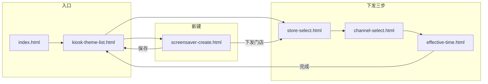

# 新建屏保到下发完成：流程说明（文档辅助）

> 本文描述当前原型中 **从创建屏保主题到完成一次下发配置并返回列表** 的页面顺序、操作要点、`localStorage` 数据衔接及校验规则。  
> 与 **状态与操作语义** 相关的定义见同目录 [`屏保状态与操作说明.md`](屏保状态与操作说明.md)。

---

## 1. 总览：两条常见路径

| 路径 | 适用场景 | 摘要 |
|------|----------|------|
| **A. 先保存，后下发** | 先落库主题，稍后再选门店下发 | `新建屏保` → **保存** → `屏保列表` → 该主题 **⋯ → 下发门店** → 下发三步 → **完成** |
| **B. 保存并立即下发** | 创建完直接进入下发向导 | `新建屏保` → **下发门店** →（保存主题后）自动进入下发三步 → **完成** |

两条路径在 **「选择门店」** 及之后的页面完全一致。

---

## 2. 页面顺序与步骤条（下发子流程）

下发子流程共 **3 步**，顶栏进度条宽度与页面大致对应：

| 顺序 | 页面文件 | 标题（顶栏） | 进度条（原型） | 主要操作 |
|:----:|----------|--------------|----------------|----------|
| 1 | `store-select.html` | 选择门店 | 33% | 勾选至少一家门店 → **Next** |
| 2 | `channel-select.html` | 选择渠道 | 67% | 至少勾选一个渠道（可全选）→ **Next** |
| 3 | `effective-time.html` | 选择展示生效时间 | 100% | 自定义或「立即」生效；点 **完成** → 二次确认 → 写回主题并跳转列表 |

**入口 URL**

- 从列表对已存在主题下发：`store-select.html?themeId=<主题id>`
- 新建页点「下发门店」：保存后跳转 `store-select.html?themeId=<新建主题id>`（与上同形）

---

## 3. 分页面说明

### 3.1 入口与列表

| 页面 | 文件 | 说明 |
|------|------|------|
| 营销中心首页 | `index.html` | 「进入屏保管理」→ `kiosk-theme-list.html` |
| 屏保列表 | `kiosk-theme-list.html` | **+ 新建** → `screensaver-create.html`；某主题 **⋯ → 下发门店** → `store-select.html?themeId=...` |

### 3.2 新建屏保

| 页面 | 文件 | 说明 |
|------|------|------|
| 新建屏保 | `screensaver-create.html` | 填写 **主题名称**（必填）；**竖版 / 横版** 至少一侧有素材（图片或视频）；可从本地上传，也可结合 [`material.html`](material.html) 准备的素材（页面内有引导链接）。 |

**操作按钮（页头右侧）**

- **保存**：校验名称与素材 → 生成主题 `id`（如 `t` + 时间戳）→ 写入 `localStorage.kiosk_themes`（插入列表头部）→ 跳转 **`kiosk-theme-list.html`**。  
- **下发门店**：同样校验并保存主题 → 跳转 **`store-select.html?themeId={新建id}`**，进入下发子流程。

**写入的主题字段（新建时）**（节选）

- `id`、`name`、`createTime`  
- `portraitImages` / `landscapeImages`（含压缩后的 `dataUrl` 等）  
- `effectTime` 初始为空字符串（下发完成页再写入）

### 3.3 选择门店

| 文件 | `store-select.html` |
|------|---------------------|
| **前置** | URL 带 `themeId` 时，写入 `localStorage.current_theme_id_for_distribute`，供完成页识别当前操作的主题。 |
| **操作** | 表格勾选门店；右侧展示已选列表；至少选一家后 **Next** 可点。 |
| **写出** | `selected_stores_for_distribute`：JSON 数组，`[{ name, mid }, ...]`。 |
| **下一步** | `channel-select.html` |

### 3.4 选择渠道

| 文件 | `channel-select.html` |
|------|------------------------|
| **操作** | 勾选渠道（Kiosk、eMenu、CDS 等）；至少一个才可 **Next**。 |
| **读写** | `selected_channels_for_distribute`：渠道名称字符串数组。 |
| **下一步** | `effective-time.html` |

### 3.5 选择展示生效时间并完成

| 文件 | `effective-time.html` |
|------|-------------------------|
| **操作** | 填写 **开始时间**、**结束时间**（各为日期 + 时分）。顶栏 **完成** → 弹出 **确认下发** → **确定** 后执行写库；`effectTime` 存为「`开始` - `结束`」字符串。 |
| **校验（点「完成」及确认时）** | 四项均需填写；结束 **不得早于** 开始；**同渠道多主题生效时段不可重叠**（与 `kiosk_themes` 中其他主题比较，排除当前 `current_theme_id_for_distribute`）。 |
| **写回主题**（`executeSubmitDistribute`） | 对 `current_theme_id_for_distribute` 对应主题更新：`distributeTime` 固定为 `'--'`、`effectTime`、`distributeChannels`、`distributedStores`（含门店状态、各渠道 `channelStatuses` 及后续在弹窗内维护的**按渠道** `shelfStatus`）、`localStorage.kiosk_themes` 整体保存。 |
| **清理** | 移除 `selected_stores_for_distribute`、`selected_channels_for_distribute`、`current_theme_id_for_distribute` 及历史键 `distribute_date` / `distribute_time`（若存在）等（以代码为准）。 |
| **结束跳转** | `kiosk-theme-list.html?done=1` |

---

## 4. `localStorage` 键一览（下发链路）

| 键名 | 写入页面 | 含义 |
|------|----------|------|
| `kiosk_themes` | `screensaver-create` / `effective-time` / 列表等 | 主题数组，主数据 |
| `current_theme_id_for_distribute` | `store-select`（带 `themeId` 进入时） | 当前正在下发的主题 `id` |
| `selected_stores_for_distribute` | `store-select` 点 Next | 已选门店列表 |
| `selected_channels_for_distribute` | `channel-select` | 已选渠道名称数组 |

完成下发后，与本次流程相关的临时键会在 `effective-time.html` 中清除（避免污染下一次下发）。历史版本中若曾写入 `distribute_date` / `distribute_time`，完成页也会一并清理。

---

## 5. 流程图（页面级）



**线性顺序（下发子流程）**

```
store-select.html → channel-select.html → effective-time.html → kiosk-theme-list.html
```

---

## 6. 可选关联页面（非主线必经）

| 文件 | 说明 |
|------|------|
| `material.html` | 图片素材库；新建前可上传素材再在新建页引用（按当前原型交互）。 |
| `screensaver-edit.html` | 编辑已有主题；从列表 **⋯ → 编辑屏保** 进入，带 `?id=`。 |
| `screensaver-uploaded.html` | 演示/备用「已上传」确认页，**主线从 `screensaver-create` 不经此页**；若产品单独接入可再文档化。 |

---

## 7. 完成后在列表上可做什么

下发完成后返回 **`kiosk-theme-list.html`**，主题已具备生效时间、**展示渠道**与门店结果等字段（`distributeTime` 为占位 `'--'`，列表不展示「下发时间」行）。后续可：

- 查看 **生效状态**（计算规则见 [`屏保状态与操作说明.md`](屏保状态与操作说明.md)）；门店同步结果在 **下发门店详情** 中查看；  
- **查看详情**（门店列表、重试失败下发、门店上下架/删除等）；  
- 在允许时 **编辑屏保 / 再次下发门店 / 删除主题 / 屏保下架与重新上架**（受生效与展示下架约束）。

---

## 8. 相关文件索引

| 文件 | 角色 |
|------|------|
| `index.html` | 营销中心入口 |
| `kiosk-theme-list.html` | 列表、新建入口、下发入口、状态展示 |
| `screensaver-create.html` | 新建与保存/下发门店入口 |
| `store-select.html` | 下发第 1 步 |
| `channel-select.html` | 下发第 2 步 |
| `effective-time.html` | 下发第 3 步与完成写库 |
| `屏保状态与操作说明.md` | 状态、操作、流转定义 |
| `下发门店详情产品说明.md` | 列表「下发门店详情」弹窗产品说明 |
| `屏保图片预览产品说明.md` | 列表缩略图大图预览产品说明 |
| `屏保新建到完成流程说明.docx` | Word 版（由本 Markdown 导出，修订 md 后需重新导出） |

---

*文档版本：与当前仓库 HTML/JS 行为一致；若页面或存储键有变更，请同步修订本文。*

*重新生成 Word：在项目目录执行 `python -c "import pypandoc; pypandoc.convert_file('屏保新建到完成流程说明.md','docx',outputfile='屏保新建到完成流程说明.docx',extra_args=['--standalone'])"`（需已安装 `pypandoc` 与 `pypandoc_binary`）。*
