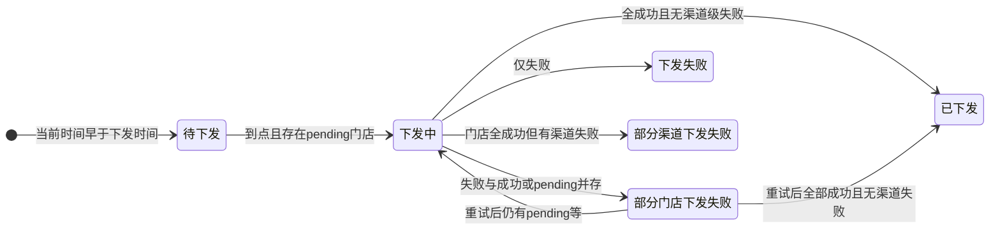
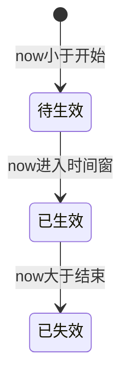
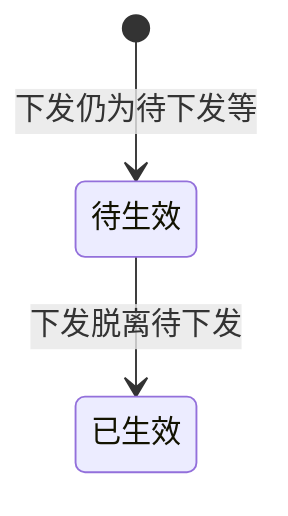
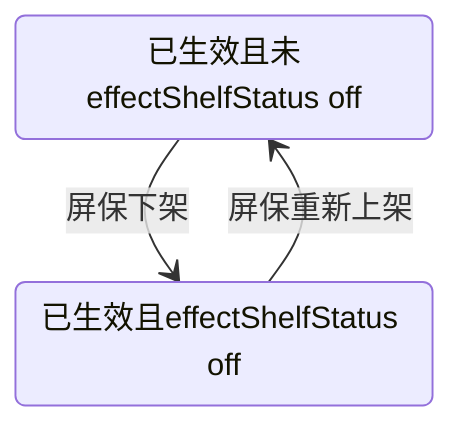

# 屏保活动主题：状态与操作说明（文档辅助）

> 本文与当前原型实现一致，对应主要页面：`kiosk-theme-list.html`、`effective-time.html` 等。数据存储以 `localStorage` 的 `kiosk_themes` 及下发流程中的若干 key 为准。

---

## 0. 如何查看 Mermaid 图示

本节 **§7.7** 中的状态图使用 **Mermaid**（` ```mermaid ` 代码块）。任选一种方式即可稳定查看：

| 方式 | 说明 |
|------|------|
| **浏览器预览（推荐，不依赖编辑器）** | 双击打开同目录下的 **`屏保状态与操作说明-图示.html`**（需能访问 CDN 以加载 Mermaid；内网环境可改为本地拷贝 `mermaid.min.js` 后改脚本路径）。 |
| **Cursor / VS Code** | 打开本仓库后，按提示安装 **推荐扩展**「Markdown Preview Mermaid Support」（见根目录 `.vscode/extensions.json`）；在 `.md` 文件中打开 **Markdown 预览**（常见快捷键 `Ctrl+Shift+V` / `Cmd+Shift+V`）即可渲染 Mermaid。 |
| **GitHub / GitLab** | 将仓库推送到远端后，在网页中打开本 `.md` 文件，平台原生支持 Mermaid 代码块渲染。 |
| **Obsidian** | 默认或开启「Mermaid」插件后，预览中即可渲染。 |

即使不渲染 Mermaid，**§7.1～§7.6 的文字、表格与 ASCII** 已覆盖全部流转关系。

---

## 1. 概念层级（勿混用）

| 层级 | 数据位置（概念） | 界面体现 |
|------|------------------|----------|
| **活动主题（屏保）** | `kiosk_themes` 中单条主题：`distributeTime`、`effectTime`、`distributeChannels`、`distributedStores`、`effectShelfStatus` 等 | 列表卡片的 **下发状态**、**生效状态**；卡片菜单 **屏保下架 / 重新上架、编辑屏保、下发门店、删除** |
| **单门店下发记录** | `distributedStores[]`：`status`、`channelStatuses`、`shelfStatus` 等 | 「下发门店详情」中每行的 **门店维度状态**、各渠道行、**门店下架 / 重新上架 / 删除** |

说明：

- **下发状态**、**待生效 / 已生效 / 已失效** 为主题级聚合或时间窗结果。
- **门店下架 / 上架** 仅作用于单条门店记录；当前实现中 **未** 将门店 `shelfStatus` 纳入主题级 `computeDistributeStatus` 的计算。

---

## 2. 下发状态（主题级）

### 2.1 前提

- 需存在可解析的 `distributeTime`，且不为 `'--'`；否则列表中可无下发状态（实现中为 `null` / 展示为「—」）。

### 2.2 判定顺序（先命中先返回）

1. **待下发**  
   - **定义**：当前时间 **早于** 所配置的下发时间点。  
   - **说明**：未到计划下发时刻；若已有历史 `distributedStores`，仍以「未到下发时间」优先显示待下发。

2. **已到或已过下发时间**，且存在 `distributedStores.length > 0` 时，按门店聚合继续判断：

   | 状态 | 条件（摘要） |
   |------|----------------|
   | **部分门店下发失败** | 存在失败门店，且（存在成功门店 **或** 仍存在下发中门店） |
   | **下发失败** | 仅失败、无成功、无下发中 |
   | **下发中** | 存在 `pending` 门店 |
   | **部分渠道下发失败** | 所有门店在门店维度均为 `success`，但存在 **渠道级失败**（`channelStatuses` 中有失败） |
   | **已下发** | 以上皆不满足时的默认终态（如：全成功且无渠道级失败） |

### 2.3 与「部分渠道下发失败」的先后关系

代码按 **先门店失败/中/全失败**，再判断 **「全门店成功 + 渠道级失败」**。因此 **部分门店下发失败** 与 **部分渠道下发失败** 不会同时出现在同一次计算结果中；门店层有失败或中时，不会落到「部分渠道下发失败」分支。

---

## 3. 生效状态（主题级）

### 3.1 前提

- 需存在 `effectTime` 且不为 `'--'`；否则无生效状态（`null`）。

### 3.2 自定义时段（`effectTime` 为「开始 - 结束」两段）

| 状态 | 定义（`now` 为当前时间） |
|------|---------------------------|
| **待生效** | `now < 开始时间` |
| **已生效** | `开始时间 ≤ now ≤ 结束时间` |
| **已失效** | `now > 结束时间` |

### 3.3 立即生效（`effectTime === '立即生效'`）

- 先计算 **下发状态**：  
  - 若下发状态为 **待下发**（或无法得到下发状态）：展示 **待生效**。  
  - 否则：展示 **已生效**。

### 3.4 与下发状态的关系

| `effectTime` 类型 | 是否依赖下发状态 |
|-------------------|------------------|
| 自定义区间 | **不依赖**；仅比较时间窗与 `now` |
| 立即生效 | **依赖**；下发仍为待下发时保持 **待生效** |

### 3.5 展示下架（叠加态，非独立「日历失效」）

- 字段：`effectShelfStatus === 'off_shelf'`（屏保 **展示下架**）。  
- 当按时间窗仍为 **已生效**，但已做展示下架时，列表可展示 **「已生效（展示已下架）」**：表示 **时间仍在生效窗内，运营侧已标记从展示侧撤下**（与「已失效」不同）。

---

## 4. 操作定义与约束

### 4.1 主题（屏保）级 — 列表卡片「⋯」菜单

| 操作 | 含义（原型） | 主要约束（当前实现） |
|------|----------------|----------------------|
| **下架**（屏保） | 写入 `effectShelfStatus = 'off_shelf'` | 当 **生效状态为「已生效」** 且 **未** 展示下架时，菜单 **仅保留「下架」** |
| **重新上架**（屏保） | 清除 `effectShelfStatus`（恢复展示在架） | 在逻辑仍为 **已生效** 且已展示下架时出现；与编辑、下发、删除一并恢复 |
| **编辑屏保** | 跳转编辑页 | 屏保处于「已生效且未展示下架」时 **不可用** |
| **下发门店** | 进入选门店/渠道流程 | 同上 |
| **删除** | 删除整条主题 | 同上 |

说明：在 **已生效且未展示下架** 时，仍可通过 **查看详情** 打开「下发门店详情」做浏览及 **门店级** 操作（见下节）。

### 4.2 门店级 — 「下发门店详情」弹窗（仅 `status === 'success'` 的门店）

| 操作 | 含义 | 约束 |
|------|------|------|
| **下架**（门店） | `shelfStatus = 'off_shelf'` | 仅 **在架** 的成功门店（未标 `off_shelf` 视为在架） |
| **重新上架**（门店） | 去掉 `shelfStatus`（恢复在架） | 仅 **已下架** 的成功门店 |
| **删除**（门店） | 从 `distributedStores` 移除 | 仅 **已下架** 的成功门店；有二次确认 |
| **编辑门店** | — | **不提供**（不支持改名称/MID） |

文案说明：界面常用 **「重新上架」**，与口语「上架」同义。

---

## 5. 跨主题约束（生效时间 + 渠道）

在 **`effective-time.html`** 完成下发时：

- 若与其他主题存在 **相同下发渠道**（以当前所选渠道与主题上 `distributeChannels` 为准；空渠道在原型中与 `Kiosk` 默认一致处理），则各主题的 **展示生效时间段不得重叠**（含「立即生效」与自定义区间、以及主题之间的区间比较）。
- 校验会排除当前正在下发的主题自身（`current_theme_id_for_distribute`）。

---

## 6. 其他时间与操作约束（完成页）

- 自定义生效时：**生效开始不得早于下发时间**；**结束不得早于开始**。
- 详见 `effective-time.html` 内校验与 Toast 提示。

---

## 7. 状态流转（文字说明 + 表 + 图）

> **说明**：若所用 Markdown 工具不渲染 Mermaid，本节 **§7.1～§7.6 的文字、表格与 ASCII** 即为完整流转说明；**§7.7** 为与之一致的 Mermaid 图示（查看方式见 **§0**）。

### 7.1 主题级「下发状态」— 驱动因素与流转

**驱动因素**（每一时刻由代码 **重新计算**，非持久「状态机字段」）：

| 因素 | 作用 |
|------|------|
| 当前时间 `now` 与 `distributeTime` | `now < 下发时刻` → 固定为 **待下发**（不再读门店列表） |
| `distributedStores` 是否存在及内容 | 仅当 **已过下发时刻** 后参与；若 **无门店记录或长度为 0**，直接落到 **已下发** |
| 用户点击「重试失败下发」（原型） | 随机改写门店/渠道结果，从而可能改变聚合后的下发状态 |

**从「待下发」离开（时间到达下发点之后）**

| 下一状态 | 条件（与代码分支一致） |
|----------|-------------------------|
| **已下发** | 无 `distributedStores` 或长度为 0（未走门店分支） |
| **下发中** | 存在至少一条 `pending` 门店 |
| **下发失败** | 有失败、无成功、无进行中 |
| **部分门店下发失败** | 有失败，且（有成功 **或** 有进行中） |
| **部分渠道下发失败** | 门店 **全部** `success`，且存在渠道级失败 |
| **已下发** | 有门店数据、无 pending、无失败、无渠道级失败 |

**在「已过下发点」之后的典型变化（非互斥穷举，便于理解）**

```
待下发 ──(now ≥ 下发时刻)──► 下发中 / 已下发 / 下发失败 / 部分门店下发失败 / 部分渠道下发失败
                                    │
                                    └──(重试、异步结果变化)──► 可在「下发中」与各类终态/组合态之间切换
```

**文字链（常见）**

1. **待下发** → 时间到 → **下发中**（出现 `pending`）→ 全部落定 → **已下发** / **下发失败** / **部分门店下发失败** / **部分渠道下发失败**。  
2. **待下发** → 时间到 → 若仍 **无任何门店记录** → **已下发**（占位语义：已到点、无门店可聚合）。  
3. **部分门店下发失败** 或 **下发中**：通过 **重试失败下发** 可能回到 **下发中**，或最终进入 **已下发** / **下发失败** 等。

---

### 7.2 主题级「生效状态」— 自定义时段（仅时间驱动）

| 上一状态 | 下一状态 | 触发条件 |
|----------|----------|----------|
| （无） | **待生效** | 已配置自定义 `effectTime`，且 `now < 开始` |
| **待生效** | **已生效** | `开始 ≤ now ≤ 结束` |
| **已生效** | **已失效** | `now > 结束` |
| **已失效** | — | 时间不回流；若改配置或数据另议（原型未实现「改时间自动复活」） |

**ASCII**

```
无生效配置 ──(填写 effectTime)──► 待生效 ──(时间流逝)──► 已生效 ──(时间流逝)──► 已失效
```

---

### 7.3 主题级「生效状态」— 立即生效（依赖下发状态）

| 上一感知状态 | 下一感知状态 | 触发条件 |
|--------------|--------------|----------|
| — | **待生效** | `effectTime === '立即生效'` 且（下发状态为 **待下发** 或无法计算） |
| **待生效** | **已生效** | 下发状态 **不再是** 待下发（例如已到下发时刻且聚合结果脱离待下发） |
| **已生效** | — | 立即生效无「日历结束」；若需下线依赖 **屏保展示下架** 或改数据（见 7.4） |

---

### 7.4 屏保「展示在架 / 展示下架」— 与逻辑生效的叠加

仅当 **逻辑生效状态** 为 **已生效** 时，菜单与标记才区分展示层：

| `effectShelfStatus` | 列表展示（摘要） | 可转方向 |
|---------------------|------------------|----------|
| 未设置 / 非 `off_shelf` | **已生效**（在架展示） | 用户点 **屏保下架** → `off_shelf` |
| `off_shelf` | **已生效（展示已下架）** | 用户点 **重新上架** → 清除字段 |

**约束**：与 **日历已失效** 无关；**已失效** 后菜单逻辑以代码为准（当前原型主要约束在「逻辑已生效 + 未展示下架」）。

**ASCII**

```
逻辑已生效 + 展示在架  ⇄  逻辑已生效 + 展示已下架
        屏保下架                    屏保重新上架
```

---

### 7.5 门店级 — 下发结果 `status`（pending / success / failed）

单条 `distributedStores` 内 **门店维度** `status`（由完成下发或重试逻辑写入/改写）：

| 从 | 到 | 典型触发（原型） |
|----|----|------------------|
| **pending** | **success** / **failed** | 异步/模拟下发结束 |
| **failed** | **success** / **pending** / **failed** | 「重试失败下发」随机结果 |

**说明**：**下架 / 重新上架 / 删除** 仅对 **`success`** 门店展示；`pending` / `failed` 无上下架按钮。

---

### 7.6 门店级 — 成功门店「在架 / 已下架」（`shelfStatus`）

仅 `status === 'success'`：

| 从 | 到 | 操作 / 条件 |
|----|----|----------------|
| **在架**（无 `off_shelf`） | **已下架** | 用户点 **下架** → `shelfStatus = 'off_shelf'` |
| **已下架** | **在架** | 用户点 **重新上架** → 删除 `shelfStatus` |
| **已下架** | **记录删除** | 用户点 **删除** 并确认 → 从数组移除该 MID |

**ASCII**

```
在架 ──下架──► 已下架 ──重新上架──► 在架
          │
          └──删除──► (从 distributedStores 移除)
```

---

### 7.7 Mermaid 图示（与 §7.1～§7.6 对应）

以下为 **Mermaid 源码**；渲染效果见 **§0**（浏览器打开 **`屏保状态与操作说明-图示.html`** 或使用推荐扩展预览本文件）。

#### 7.7.1 下发状态（典型）



#### 7.7.2 生效状态（自定义时段）



#### 7.7.3 立即生效下的生效状态



#### 7.7.4 屏保展示在架 / 展示下架



#### 7.7.5 成功门店在架 / 下架


---

## 8. 读状态时优先级口诀

1. **下发时间未到** → **待下发**（不再深入门店态）。  
2. **到点后** 再按门店 `success / pending / failed` 与渠道失败标志得到 **下发中 / 各类失败 / 已下发**。  
3. **生效状态**：自定义只看 **生效窗与 now**；**立即生效** 需多看 **是否仍待下发**。  
4. **操作权限**：**屏保菜单** 看 **是否逻辑已生效 + 是否展示下架**；**门店行** 看 **该条是否成功 + `shelfStatus`**。

---

## 9. 相关文件索引

| 文件 | 说明 |
|------|------|
| `kiosk-theme-list.html` | `computeDistributeStatus`、`computeEffectStatus`、`isThemeEffectActiveOnShelf`、列表菜单与门店弹窗 |
| `effective-time.html` | 生效时间选择、渠道与生效区间重叠校验、写入主题字段 |
| `屏保状态与操作说明-图示.html` | 浏览器中渲染 §7.7 全部 Mermaid 图（见 §0） |
| `屏保状态与操作说明.docx` | Word 版说明（由本 Markdown 导出，修订 md 后需重新导出以同步） |
| `.vscode/extensions.json` | 推荐安装 Markdown Mermaid 预览扩展（Cursor / VS Code） |
| `屏保新建到完成流程说明.md` | 从新建屏保到下发完成的页面顺序与 `localStorage` 衔接 |
| `下发门店详情产品说明.md` | 列表「下发门店详情」弹窗：业务逻辑、状态、操作与约束 |
| `屏保图片预览产品说明.md` | 列表点击缩略图大图预览：逻辑、操作、层级与约束 |
| `屏保-改动内容.md` | 历史改动记录（若与本文冲突，以代码为准并建议同步修订） |

---

*文档版本：随仓库原型迭代维护；修订时请同步核对上述 HTML 中的函数与字段名。*

*重新生成 Word：在项目根目录执行 `python -c "import pypandoc; pypandoc.convert_file('屏保状态与操作说明.md','docx',outputfile='屏保状态与操作说明.docx',extra_args=['--standalone'])"`（需已安装 `pypandoc` 与 `pypandoc_binary`）。*
