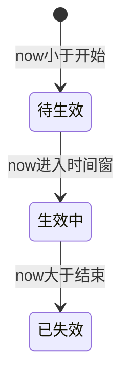
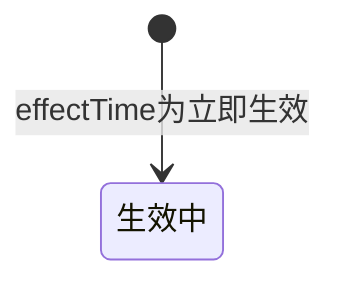
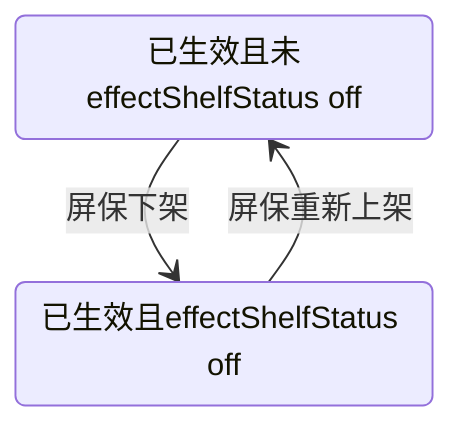
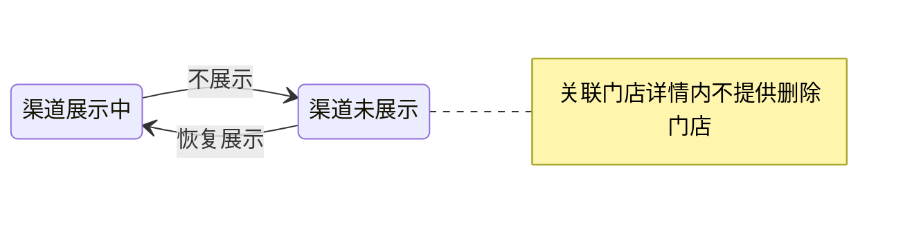

# 屏保活动主题：状态与操作说明（文档辅助）

> 本文与当前原型实现一致，对应主要页面：`kiosk-theme-list.html`、`effective-time.html` 等。数据存储以 `localStorage` 的 `kiosk_themes` 及下发流程中的若干 key 为准。

---

## 0. 如何查看 Mermaid 图示

本节 **§7.7** 中的状态图使用 **Mermaid**（` ```mermaid ` 代码块）。任选一种方式即可稳定查看：

| 方式 | 说明 |
|------|------|
| **浏览器预览（推荐，不依赖编辑器）** | 双击打开同目录下的 **`屏保状态与操作说明-图示.html`**（需能访问 CDN 以加载 Mermaid；内网环境可改为本地拷贝 `mermaid.min.js` 后改脚本路径）。 |
| **Cursor / VS Code** | 打开本仓库后，按提示安装 **推荐扩展**「Markdown Preview Mermaid Support」（见根目录 `.vscode/extensions.json`）；在 `.md` 文件中打开 **Markdown 预览**（常见快捷键 `Ctrl+Shift+V` / `Cmd+Shift+V`）即可渲染 Mermaid。 |
| **GitHub / GitLab** | 将仓库推送到远端后，在网页中打开本 `.md` 文件，平台原生支持 Mermaid 代码块渲染。 |
| **Obsidian** | 默认或开启「Mermaid」插件后，预览中即可渲染。 |

即使不渲染 Mermaid，**§7.2～§7.6 的文字、表格与 ASCII** 已覆盖生效与门店侧流转关系。

---

## 1. 概念层级（勿混用）

| 层级 | 数据位置（概念） | 界面体现 |
|------|------------------|----------|
| **活动主题（屏保）** | `kiosk_themes` 中单条主题：`distributeTime`、`effectTime`（及可选 `effectStartUtc` / `effectEndUtc`）、`distributeChannels`（展示为**关联渠道**）、`distributedStores`、`publishStatus` 等 | 列表卡片展示 **上架状态**、创建时间、生效时间、关联渠道等；**不展示**主题级「下发状态」聚合、**不展示**主题级「生效状态」列（生效语义在关联门店详情等场景按门店/规则使用）。卡片菜单见 §4.1 |
| **单门店关联记录** | `distributedStores[]`：`name`、`mid`、可选 `timezone`、`channelStatuses`（`channel` + 可选 `shelfStatus` / `displaySync`）、兼容旧数据的门店级 `shelfStatus` 等 | 「**关联门店详情**」弹窗：门店信息、**门店生效状态**、各渠道 **展示中 / 未展示** 与 **不展示 / 恢复展示**（受上架与门店生效约束）；**无**弹窗内删除门店 / 下发重试 |

说明：

- **待生效 / 生效中 / 已失效** 为主题级 **生效状态**（由 `effectTime` 或 UTC 字段解析时间窗与 `now` 比较；新配置为开始—结束；本地旧数据可能仍为「立即生效」）。
- **渠道展示中 / 未展示** 在 **关联门店详情** 中按渠道查看与操作（见 [`下发门店详情产品说明.md`](下发门店详情产品说明.md)）。当前列表 **不提供** 门店维度「下发成功 / 失败」筛选。

---

## 2. 列表上的「下发状态」与「生效状态」列（已移除）

- **`kiosk-theme-list.html`** 的屏保卡片 **不再展示、不提供筛选** 主题级「下发状态」聚合。
- 卡片展示 **上架状态**；**不展示**主题级「生效状态」列。
- 门店 **生效状态** 在 **关联门店详情** 中按门店展示与筛选（选项随上架状态收敛），见 [`下发门店详情产品说明.md`](下发门店详情产品说明.md)。

---

## 3. 生效状态（主题级，计算口径）

> 列表卡片 **不单独展示**「生效状态」列；以下仍为数据层与弹窗/校验共用口径（`kiosk-theme-list.html` 中 `getThemeEffectStatus` / `computeEffectStatus` 等）。

### 3.1 前提

- 需存在可解析的生效时间（`effectTime` 或 `effectStartUtc` + `effectEndUtc`）；否则可能无生效状态（`null`）。

### 3.2 时段（`effectTime` 为「开始 - 结束」或 UTC 字段）

| 状态 | 定义（`now` 为当前时间） |
|------|---------------------------|
| **待生效** | `now < 开始时间` |
| **生效中** | `开始时间 ≤ now ≤ 结束时间` |
| **已失效** | `now > 结束时间` |

### 3.3 历史值：「立即生效」（仅旧数据）

- 若 `effectTime === '立即生效'`：计算上视为 **生效中**（兼容旧数据）；**新流程** 以开始—结束时段为准。

### 3.4 说明

| `effectTime` 形式 | 计算依据 |
|-------------------|----------|
| `开始 - 结束` 两段 / UTC | 比较时间窗与 `now` |
| `立即生效` | **生效中**（兼容旧数据） |

### 3.5 展示下架（`effectShelfStatus`）

- **当前列表原型**（`kiosk-theme-list.html`）**未使用** `effectShelfStatus` 驱动菜单；若后续接入，可与「逻辑生效中 + 展示下架」叠加表述，与日历 **已失效** 区分。

---

## 4. 操作定义与约束

### 4.1 主题（屏保）级 — 列表卡片「⋯」菜单

规则以 **`getListShelfStatus(theme)`** 的文案为准（草稿 **待上架**；已发布且时间窗未结束为 **已上架**；已发布且时间窗已结束为 **已下架**）：

| 主题情况 | 菜单内容 |
|----------|----------|
| **草稿**（`publishStatus !== 'published'`） | **上架**、**编辑**、**删除** |
| **已上架**（`publishStatus === 'published'` 且上架状态为 **已上架**） | **仅下架**（不可编辑、不可删除） |
| **已下架**（上架状态为 **已下架**） | **编辑**、**删除** |

说明：已上架时仍可通过 **查看详情** 打开「**关联门店详情**」浏览门店与渠道（渠道操作受 §4.2 约束）。

### 4.2 门店级 — 「关联门店详情」弹窗（按渠道展示控制）

| 操作 | 含义 | 约束（当前 UI） |
|------|------|-----------------|
| **不展示** / **恢复展示**（单渠道） | 发起渠道展示变更（底层可写 `displaySync` 等） | 主题须 **已上架**，且该门店 **生效中**；渠道展示 **展示中** ↔ **未展示** |
| **全渠道不展示** / **全渠道展示** | 批量对门店下全部渠道发起同向操作 | 同上；批量按钮按全渠道同态/混合态显示（见产品说明文档） |
| **删除门店** / **重试下发** | — | **当前弹窗不提供** |

文案与细节见 [`下发门店详情产品说明.md`](下发门店详情产品说明.md)。弹窗内渠道徽标为 **展示中 / 未展示**，**不展示**执行中、失败与重试入口（数据层仍可有 `displaySync` 供原型计时器使用）。

---

## 5. 跨主题约束（生效时间 + 渠道）

在 **`effective-time.html`** 完成下发时：

- 若与其他主题存在 **相同展示渠道**（以当前所选渠道与主题上 `distributeChannels` 为准；空渠道在原型中与 `Kiosk` 默认一致处理），则各主题的 **展示生效时间段不得重叠**（当前页仅区间与区间比较；与其它主题若仍为「立即生效」旧值，重叠校验仍按 `effective-time.html` 内 `parseStoredThemeEffectRange` 处理）。
- 校验会排除当前正在下发的主题自身（`current_theme_id_for_distribute`）。

---

## 6. 其他时间与操作约束（完成页）

- 填写开始、结束时：**结束不得早于开始**；**同渠道生效区间不可重叠**（见第 5 节）。
- 详见 `effective-time.html` 内校验与 Toast 提示。

---

## 7. 状态流转（文字说明 + 表 + 图）

> **说明**：若所用 Markdown 工具不渲染 Mermaid，本节 **§7.2～§7.6 的文字、表格与 ASCII** 即为完整流转说明；**§7.7** 为与之一致的 Mermaid 图示（查看方式见 **§0**）。主题级「下发状态」已从列表页移除，故 **无 §7.1 图示**。

### 7.2 主题级「生效状态」— 自定义时段（仅时间驱动）

| 上一状态 | 下一状态 | 触发条件 |
|----------|----------|----------|
| （无） | **待生效** | 已配置时段型生效时间，且 `now < 开始` |
| **待生效** | **生效中** | `开始 ≤ now ≤ 结束` |
| **生效中** | **已失效** | `now > 结束` |
| **已失效** | — | 时间不回流；若改配置或数据另议（原型未实现「改时间自动复活」） |

**ASCII**

```
无生效配置 ──(填写生效时间)──► 待生效 ──(时间流逝)──► 生效中 ──(时间流逝)──► 已失效
```

---

### 7.3 主题级「生效状态」— 历史「立即生效」（旧数据）

| 上一感知状态 | 下一感知状态 | 触发条件 |
|--------------|--------------|----------|
| — | **生效中** | `effectTime === '立即生效'`（仅存于历史数据） |
| **生效中** | — | 无日历结束时间；若需下线依赖改数据或业务策略（见 3.5） |

---

### 7.4 屏保「展示在架 / 展示下架」（`effectShelfStatus`，预留）

当前 **列表菜单不以 `effectShelfStatus` 驱动**；若产品恢复该字段，可与 **生效中** 时间窗叠加使用（与日历 **已失效** 区分）。以下为概念关系，非当前按钮文案：

| `effectShelfStatus` | 概念 |
|---------------------|------|
| 未设置 / 非 `off_shelf` | 时间窗内视为「可展示侧在架」 |
| `off_shelf` | 时间窗内仍可标记「展示侧下架」 |

---

### 7.5 门店级 — 下发结果 `status`（pending / success / failed）

单条 `distributedStores` 内 **门店维度** `status`（由完成下发或重试逻辑写入/改写）：

| 从 | 到 | 典型触发（原型） |
|----|----|------------------|
| **pending** | **success** / **failed** | 异步/模拟下发结束 |
| **failed** | **success** / **pending** / **failed** | 「重试失败下发」随机结果 |

**说明**：列表 **关联门店详情** 内渠道行展示 **展示中 / 未展示** 与操作按钮；**不在该弹窗展示**「下发成功/失败」类门店统计；**不提供**弹窗内删除门店。

---

### 7.6 门店级 — 渠道「展示中 / 未展示」（`channelStatuses[].shelfStatus` + `displaySync`）

每条 **`channelStatuses`** 行（含 `channel`，可选 `shelfStatus`、可选 **`displaySync`**）：

| 稳态 | 用户操作 | 说明 |
|------|----------|------|
| **展示中** | 点 **不展示** | 写入异步流程；成功后 `shelfStatus = 'off_shelf'` |
| **未展示** | 点 **恢复展示** | 成功后清除该渠道 `shelfStatus`（及必要时门店级 `off_shelf`） |

弹窗 **不展示** 执行中 / 失败 / 重试 UI；底层仍可有 `displaySync` 与原型计时器。

**ASCII（单渠道稳态）**

```
展示中 ──不展示──► 未展示 ──恢复展示──► 展示中
```

---

### 7.7 Mermaid 图示（与 §7.2～§7.6 对应）

以下为 **Mermaid 源码**；渲染效果见 **§0**（浏览器打开 **`屏保状态与操作说明-图示.html`** 或使用推荐扩展预览本文件）。**不含**已移除的列表主题级「下发状态」图。

#### 7.7.1 生效状态（自定义时段）



#### 7.7.2 历史「立即生效」下的生效状态（旧数据）



#### 7.7.3 屏保展示在架 / 展示下架



#### 7.7.4 渠道展示中 / 未展示（按渠道）



---

## 8. 读状态时优先级口诀

1. **生效状态**：时段型生效时间看 **生效窗与 now**；历史 **立即生效** 视为 **生效中**。  
2. **列表菜单**：以 **上架状态** 为主（§4.1）；**关联门店详情** 内渠道操作需 **已上架 + 门店生效中**（见 [`下发门店详情产品说明.md`](下发门店详情产品说明.md)）。  
3. 列表 **不提供** 主题级「下发状态」聚合与「生效状态」列；门店侧 **无** 下发成功/失败统计条。

---

## 9. 相关文件索引

| 文件 | 说明 |
|------|------|
| `kiosk-theme-list.html` | `computeEffectStatus`、`isThemeEffectActiveOnShelf`、列表菜单与门店弹窗 |
| `effective-time.html` | 生效时间选择、渠道与生效区间重叠校验、写入主题字段 |
| `屏保状态与操作说明-图示.html` | 浏览器中渲染 §7.7 全部 Mermaid 图（见 §0） |
| `屏保状态与操作说明.docx` | Word 版说明（由本 Markdown 导出，修订 md 后需重新导出以同步） |
| `.vscode/extensions.json` | 推荐安装 Markdown Mermaid 预览扩展（Cursor / VS Code） |
| `屏保新建到完成流程说明.md` | 从新建屏保到下发完成的页面顺序与 `localStorage` 衔接 |
| `下发门店详情产品说明.md` | 列表「下发门店详情」弹窗：业务逻辑、状态、操作与约束 |
| `屏保图片预览产品说明.md` | 列表点击缩略图大图预览：逻辑、操作、层级与约束 |
| `屏保-改动内容.md` | 历史改动记录（若与本文冲突，以代码为准并建议同步修订） |

---

*文档版本：随仓库原型迭代维护；修订时请同步核对上述 HTML 中的函数与字段名。*

*重新生成 Word：在项目根目录执行 `python -c "import pypandoc; pypandoc.convert_file('屏保状态与操作说明.md','docx',outputfile='屏保状态与操作说明.docx',extra_args=['--standalone'])"`（需已安装 `pypandoc` 与 `pypandoc_binary`）。*
