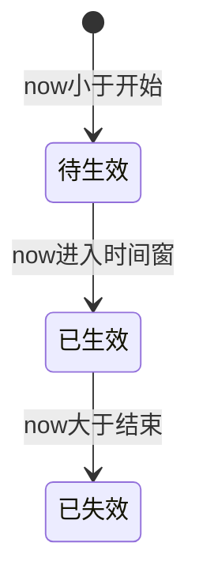
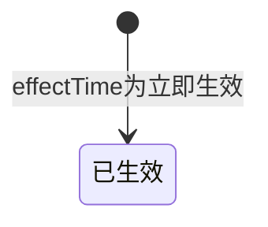
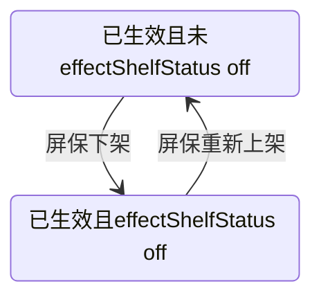
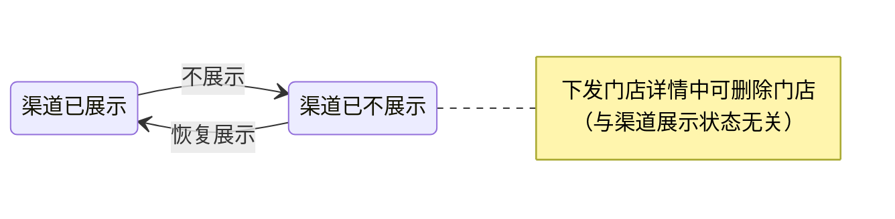

# 屏保活动主题：状态与操作说明（文档辅助）

> 本文与当前原型实现一致，对应主要页面：`kiosk-theme-list.html`、`effective-time.html` 等。数据存储以 `localStorage` 的 `kiosk_themes` 及下发流程中的若干 key 为准。

---

## 0. 如何查看 Mermaid 图示

本节 **§7.7** 中的状态图使用 **Mermaid**（` ```mermaid ` 代码块）。任选一种方式即可稳定查看：

| 方式 | 说明 |
|------|------|
| **浏览器预览（推荐，不依赖编辑器）** | 双击打开同目录下的 **`屏保状态与操作说明-图示.html`**（需能访问 CDN 以加载 Mermaid；内网环境可改为本地拷贝 `mermaid.min.js` 后改脚本路径）。 |
| **Cursor / VS Code** | 打开本仓库后，按提示安装 **推荐扩展**「Markdown Preview Mermaid Support」（见根目录 `.vscode/extensions.json`）；在 `.md` 文件中打开 **Markdown 预览**（常见快捷键 `Ctrl+Shift+V` / `Cmd+Shift+V`）即可渲染 Mermaid。 |
| **GitHub / GitLab** | 将仓库推送到远端后，在网页中打开本 `.md` 文件，平台原生支持 Mermaid 代码块渲染。 |
| **Obsidian** | 默认或开启「Mermaid」插件后，预览中即可渲染。 |

即使不渲染 Mermaid，**§7.2～§7.6 的文字、表格与 ASCII** 已覆盖生效与门店侧流转关系。

---

## 1. 概念层级（勿混用）

| 层级 | 数据位置（概念） | 界面体现 |
|------|------------------|----------|
| **活动主题（屏保）** | `kiosk_themes` 中单条主题：`distributeTime`、`effectTime`、`distributeChannels`（展示为**展示渠道**）、`distributedStores`、`effectShelfStatus` 等 | 列表卡片仅 **生效状态**（及创建时间、生效时间、展示渠道等）；**不展示**主题级「下发状态」；卡片菜单 **屏保下架 / 重新上架、编辑屏保、下发门店、删除** |
| **单门店下发记录** | `distributedStores[]`：`status`、`channelStatuses`（`channel` + 可选 `shelfStatus`；新数据**不含**渠道 `status`）、兼容旧数据的门店级 `shelfStatus` 等 | 「下发门店详情」中每行的 **门店维度状态**、各渠道行、**不展示 / 恢复展示**、**删除门店** |

说明：

- **待生效 / 已生效 / 已失效** 为主题级 **生效状态**（由 `effectTime` 时段与 `now` 比较；新下发仅配置开始—结束；本地旧数据可能仍为「立即生效」）。
- **门店下架 / 上架** 仅作用于单条门店记录；各门店 **成功 / 下发中 / 失败** 在 **下发门店详情** 中查看与筛选。

---

## 2. 列表上的「下发状态」（已移除）

- **`kiosk-theme-list.html`** 的屏保卡片 **不再展示、不提供筛选** 主题级「下发状态」标签（不再调用 `computeDistributeStatus`）。
- 门店维度的成功 / 下发中 / 失败及渠道行，仍在 **下发门店详情** 弹窗中展示；弹窗内筛选项文案为 **「门店状态」**。

---

## 3. 生效状态（主题级）

### 3.1 前提

- 需存在 `effectTime` 且不为 `'--'`；否则无生效状态（`null`）。

### 3.2 时段（`effectTime` 为「开始 - 结束」两段，当前下发页唯一写法）

| 状态 | 定义（`now` 为当前时间） |
|------|---------------------------|
| **待生效** | `now < 开始时间` |
| **已生效** | `开始时间 ≤ now ≤ 结束时间` |
| **已失效** | `now > 结束时间` |

### 3.3 历史值：「立即生效」（仅旧数据）

- 若 `effectTime === '立即生效'`（历史下发产生），列表 **生效状态** 仍固定为 **已生效**（见 `kiosk-theme-list.html`）；**新流程** 不再写入该值。

### 3.4 说明

| `effectTime` 形式 | 计算依据 |
|-------------------|----------|
| `开始 - 结束` 两段 | 仅比较时间窗与 `now`（见 3.2） |
| `立即生效` | 恒为 **已生效**（见 3.3，兼容旧数据） |

### 3.5 展示下架（叠加态，非独立「日历失效」）

- 字段：`effectShelfStatus === 'off_shelf'`（屏保 **展示下架**）。  
- 当按时间窗仍为 **已生效**，但已做展示下架时，列表可展示 **「已生效（展示已下架）」**：表示 **时间仍在生效窗内，运营侧已标记从展示侧撤下**（与「已失效」不同）。

---

## 4. 操作定义与约束

### 4.1 主题（屏保）级 — 列表卡片「⋯」菜单

| 操作 | 含义（原型） | 主要约束（当前实现） |
|------|----------------|----------------------|
| **下架**（屏保） | 写入 `effectShelfStatus = 'off_shelf'` | 当 **生效状态为「已生效」** 且 **未** 展示下架时，菜单 **仅保留「下架」** |
| **重新上架**（屏保） | 清除 `effectShelfStatus`（恢复展示在架） | 在逻辑仍为 **已生效** 且已展示下架时出现；与编辑、下发、删除一并恢复 |
| **编辑屏保** | 跳转编辑页 | 屏保处于「已生效且未展示下架」时 **不可用** |
| **下发门店** | 进入选门店/渠道流程 | 同上 |
| **删除** | 删除整条主题 | 同上 |

说明：在 **已生效且未展示下架** 时，仍可通过 **查看详情** 打开「下发门店详情」做浏览及 **门店级** 操作（见下节）。

### 4.2 门店级 — 「下发门店详情」弹窗（按渠道展示控制；删除为整店）

| 操作 | 含义 | 约束 |
|------|------|------|
| **不展示**（渠道） | 对该条 `channelStatuses[]` 项写入 `shelfStatus = 'off_shelf'` | 仅该渠道当前为 **已展示** |
| **恢复展示**（渠道） | `delete` 该渠道项上的 `shelfStatus`；若存在旧数据门店级 `store.shelfStatus` 则一并清除 | 仅该渠道为 **已不展示** |
| **删除**（门店） | 从 `distributedStores` 移除该 `mid` | 任意门店维度状态均可删除；有二次确认 |
| **编辑门店** | — | **不提供**（不支持改名称/MID） |

文案说明：渠道侧使用 **已展示 / 已不展示** 与 **不展示 / 恢复展示**（与屏保主题级「展示下架」表述区分）。

---

## 5. 跨主题约束（生效时间 + 渠道）

在 **`effective-time.html`** 完成下发时：

- 若与其他主题存在 **相同展示渠道**（以当前所选渠道与主题上 `distributeChannels` 为准；空渠道在原型中与 `Kiosk` 默认一致处理），则各主题的 **展示生效时间段不得重叠**（当前页仅区间与区间比较；与其它主题若仍为「立即生效」旧值，重叠校验仍按 `effective-time.html` 内 `parseStoredThemeEffectRange` 处理）。
- 校验会排除当前正在下发的主题自身（`current_theme_id_for_distribute`）。

---

## 6. 其他时间与操作约束（完成页）

- 填写开始、结束时：**结束不得早于开始**；**同渠道生效区间不可重叠**（见第 5 节）。
- 详见 `effective-time.html` 内校验与 Toast 提示。

---

## 7. 状态流转（文字说明 + 表 + 图）

> **说明**：若所用 Markdown 工具不渲染 Mermaid，本节 **§7.2～§7.6 的文字、表格与 ASCII** 即为完整流转说明；**§7.7** 为与之一致的 Mermaid 图示（查看方式见 **§0**）。主题级「下发状态」已从列表页移除，故 **无 §7.1 图示**。

### 7.2 主题级「生效状态」— 自定义时段（仅时间驱动）

| 上一状态 | 下一状态 | 触发条件 |
|----------|----------|----------|
| （无） | **待生效** | 已配置时段型 `effectTime`，且 `now < 开始` |
| **待生效** | **已生效** | `开始 ≤ now ≤ 结束` |
| **已生效** | **已失效** | `now > 结束` |
| **已失效** | — | 时间不回流；若改配置或数据另议（原型未实现「改时间自动复活」） |

**ASCII**

```
无生效配置 ──(填写 effectTime)──► 待生效 ──(时间流逝)──► 已生效 ──(时间流逝)──► 已失效
```

---

### 7.3 主题级「生效状态」— 历史「立即生效」（旧数据）

| 上一感知状态 | 下一感知状态 | 触发条件 |
|--------------|--------------|----------|
| — | **已生效** | `effectTime === '立即生效'`（仅存于历史数据） |
| **已生效** | — | 无日历结束时间；若需下线依赖 **屏保展示下架** 或改数据（见 7.4） |

---

### 7.4 屏保「展示在架 / 展示下架」— 与逻辑生效的叠加

仅当 **逻辑生效状态** 为 **已生效** 时，菜单与标记才区分展示层：

| `effectShelfStatus` | 列表展示（摘要） | 可转方向 |
|---------------------|------------------|----------|
| 未设置 / 非 `off_shelf` | **已生效**（在架展示） | 用户点 **屏保下架** → `off_shelf` |
| `off_shelf` | **已生效（展示已下架）** | 用户点 **重新上架** → 清除字段 |

**约束**：与 **日历已失效** 无关；**已失效** 后菜单逻辑以代码为准（当前原型主要约束在「逻辑已生效 + 未展示下架」）。

**ASCII**

```
逻辑已生效 + 展示在架  ⇄  逻辑已生效 + 展示已下架
        屏保下架                    屏保重新上架
```

---

### 7.5 门店级 — 下发结果 `status`（pending / success / failed）

单条 `distributedStores` 内 **门店维度** `status`（由完成下发或重试逻辑写入/改写）：

| 从 | 到 | 典型触发（原型） |
|----|----|------------------|
| **pending** | **success** / **failed** | 异步/模拟下发结束 |
| **failed** | **success** / **pending** / **failed** | 「重试失败下发」随机结果 |

**说明**：各渠道行展示 **已展示 / 已不展示** 与操作按钮，**不在渠道行展示**「下发成功/失败」类状态；**删除门店** 每条记录均可操作（与渠道展示状态无关）。

---

### 7.6 门店级 — 渠道「已展示 / 已不展示」（`channelStatuses[].shelfStatus`）

每条 **`channelStatuses`** 行（新数据仅含 `channel`，可选 `shelfStatus`）：

| 从 | 到 | 操作 / 条件 |
|----|----|----------------|
| **已展示**（该渠道无 `off_shelf`，且不因旧数据 `store.shelfStatus` 视为整店不展示） | **已不展示** | 用户点 **不展示** |
| **已不展示** | **已展示** | 用户点 **恢复展示** |

同弹窗内还可 **删除门店**（与上表渠道展示状态无关）：点 **删除门店** 并确认 → 从 `distributedStores` 移除该 MID。

**ASCII（单渠道）**

```
已展示 ──不展示──► 已不展示 ──恢复展示──► 已展示
```

---

### 7.7 Mermaid 图示（与 §7.2～§7.6 对应）

以下为 **Mermaid 源码**；渲染效果见 **§0**（浏览器打开 **`屏保状态与操作说明-图示.html`** 或使用推荐扩展预览本文件）。**不含**已移除的列表主题级「下发状态」图。

#### 7.7.1 生效状态（自定义时段）



#### 7.7.2 历史「立即生效」下的生效状态（旧数据）



#### 7.7.3 屏保展示在架 / 展示下架



#### 7.7.4 渠道已展示 / 已不展示（按渠道）



---

## 8. 读状态时优先级口诀

1. **生效状态**：时段型 `effectTime` 只看 **生效窗与 now**；历史 **立即生效** 恒为 **已生效**。  
2. **操作权限**：**屏保菜单** 看 **是否逻辑已生效 + 是否展示下架**；**门店弹窗** 内按 **`channelStatuses[].shelfStatus`**（及旧数据门店级 `shelfStatus`）判断渠道 **已展示 / 已不展示**；**删除门店** 与渠道展示状态无关。  
3. 列表 **不提供** 主题级「下发状态」聚合；门店同步结果以弹窗内 **门店状态** 为准。

---

## 9. 相关文件索引

| 文件 | 说明 |
|------|------|
| `kiosk-theme-list.html` | `computeEffectStatus`、`isThemeEffectActiveOnShelf`、列表菜单与门店弹窗 |
| `effective-time.html` | 生效时间选择、渠道与生效区间重叠校验、写入主题字段 |
| `屏保状态与操作说明-图示.html` | 浏览器中渲染 §7.7 全部 Mermaid 图（见 §0） |
| `屏保状态与操作说明.docx` | Word 版说明（由本 Markdown 导出，修订 md 后需重新导出以同步） |
| `.vscode/extensions.json` | 推荐安装 Markdown Mermaid 预览扩展（Cursor / VS Code） |
| `屏保新建到完成流程说明.md` | 从新建屏保到下发完成的页面顺序与 `localStorage` 衔接 |
| `下发门店详情产品说明.md` | 列表「下发门店详情」弹窗：业务逻辑、状态、操作与约束 |
| `屏保图片预览产品说明.md` | 列表点击缩略图大图预览：逻辑、操作、层级与约束 |
| `屏保-改动内容.md` | 历史改动记录（若与本文冲突，以代码为准并建议同步修订） |

---

*文档版本：随仓库原型迭代维护；修订时请同步核对上述 HTML 中的函数与字段名。*

*重新生成 Word：在项目根目录执行 `python -c "import pypandoc; pypandoc.convert_file('屏保状态与操作说明.md','docx',outputfile='屏保状态与操作说明.docx',extra_args=['--standalone'])"`（需已安装 `pypandoc` 与 `pypandoc_binary`）。*
